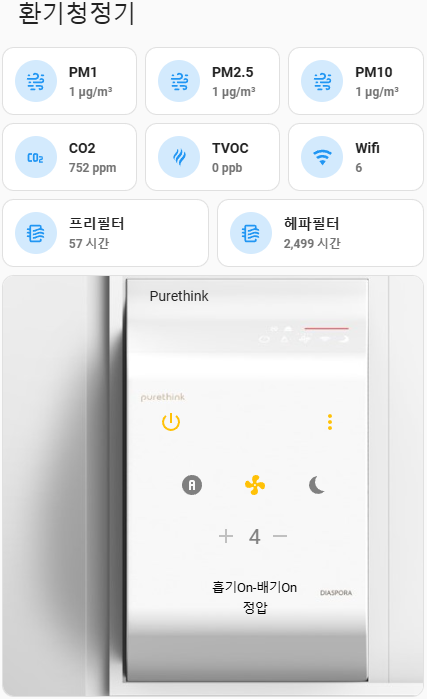

# 창문형 열교환기 - Purethink

[퓨어싱크](https://purethink.co.kr/) 제품을 Home Assistant 에서 제어합니다.

## 1. Purethink 사용 준비

1. Purethink 앱에서 등록할 때 기기를 발견했을 때 화면에 나오는 "DIV01-1234AB" 또는 "THESOOP-1234AB" 형태의 이름을 기억해 둡니다.
2. 설치하신지 오래 되어 기억이 안나시면 공유기에서 Purethink 제품의 MAC을 확인하시고 마지막 6자리를 메모해 둡니다.
3. "DIV01-MAC 6자리" 또는 "THESOOP-MAC 6자리" 형태로 둘 중에 하나입니다.

## 2. Home Assistant에 Purethink Ventilation 설치

### HACS 또는 Manual 설치

1. HACS를 이용하거나 수동으로 **Purethink**를 설치합니다.
2. 설치 후 Home Assistant를 재부팅합니다.

### 통합 구성 요소 추가

1. **설정 -> 기기 및 서비스 -> 통합구성요소 추가하기**에서 `Purethink Ventilation`을 추가합니다.
2. 설정 항목을 입력합니다.
   - **friendly_name**: 원하는 센서 이름을 입력합니다(Purethink 로 넣으시면 아래쪽의 Lovelace 적용시 센서 이름 변경이 필요 없음)
   - **device_id**: 사용 준비에서 구한 "DIV01-MAC6자리" 또는 "THESOOP-MAC6자리"

추가가 완료되면 총 17개의 entity_id가 추가 됩니다.
센서류는 20~30초 정도 후에 값이 올라오면서 정상으로 보이실 겁니다.

## 3. Lovelace 설정
현재 리포의 images 폴더 안에 있는 purethink3.jpg 파일을 다운 받으신 후에 HA의 www 폴더 안에 올려 줍니다.
lovelace.yaml 파일 안의 내용을 복사하셔서 카드를 구성합니다.
