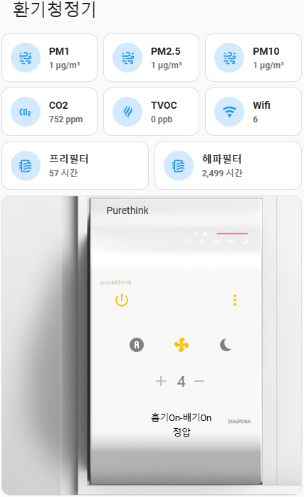

# 창문형 열교환기 - Purethink



[퓨어싱크](https://purethink.co.kr/) 제품을 Home Assistant 에서 제어합니다.

## 1. Purethink 사용 준비

1. Purethink 앱에서 등록할 때 기기를 발견했을 때 화면에 나오는 "DIV01-1234AB" 또는 "THESOOP-1234AB" 형태의 이름을 기억해 둡니다.
2. 설치하신지 오래 되어 기억이 안나시면 공유기에서 Purethink 제품의 MAC을 확인하시고 마지막 6자리를 메모해 둡니다.
3. "DIV01-MAC 6자리" 또는 "THESOOP-MAC 6자리" 형태로 둘 중에 하나입니다.

## 2. Home Assistant에 Purethink Ventilation 설치

### HACS 또는 Manual 설치

1. HACS를 이용하거나 수동으로 **Purethink**를 설치합니다.
2. 설치 후 Home Assistant를 재부팅합니다.

### 통합 구성 요소 추가

1. **설정 -> 기기 및 서비스 -> 통합구성요소 추가하기**에서 `Purethink Ventilation`을 추가합니다.
2. 설정 항목을 입력합니다.
   - **friendly_name**: 원하는 센서 이름을 입력합니다(Purethink 로 넣으시면 아래쪽의 Lovelace 적용시 센서 이름 변경이 필요 없음)
   - **device_id**: 사용 준비에서 구한 "DIV01-MAC6자리" 또는 "THESOOP-MAC6자리"
   - **mqtt_mode**: 제조사 서버(`manufacturer`, 기본값) 또는 내부망 서버(`local`)를 선택합니다.
   - 내부망 서버를 선택하면 다음 단계에서 호스트, 포트(기본 `1883`), 선택 사항인 사용자 이름과 비밀번호를 입력합니다. 기기 메시지가 해당 브로커의 `/things/<device_id>/shadow` 토픽으로 전달되도록 별도로 구성되어 있어야 합니다.

기존 등록 기기는 설정 변경 없이 제조사 서버를 계속 사용합니다. 여러 기기를 등록하면 각 기기가 독립적인 MQTT 연결을 사용합니다.

추가가 완료되면 fan, 전원, 압력·흡배기 선택 및 센서 엔티티가 생성됩니다.
센서류는 20~30초 정도 후에 값이 올라오면서 정상으로 보이실 겁니다.

### 기존 기기의 설정 변경

1. 이 버전의 파일을 적용한 뒤 Home Assistant를 재시작합니다.
2. **설정 → 기기 및 서비스 → Purethink Ventilation**에서 변경할 통합 항목의 **⋮ → 재구성**을 선택합니다.
3. 현재 값이 채워진 폼에서 이름, 제품 ID, MQTT 서버 종류를 수정합니다.
4. 내부망 MQTT를 선택하면 호스트·포트·사용자 이름·비밀번호를 수정하고 제출합니다.

마지막 단계를 완료하면 기존 등록 항목을 갱신하고 자동으로 다시 연결합니다. 중간에 취소하거나 입력 오류가 있으면 기존 설정과 연결을 유지합니다. 제조사 MQTT로 전환하면 사용하지 않는 로컬 접속 정보를 제거합니다.

이름·MQTT 설정을 변경해도 기존 엔티티 ID와 자동화 참조는 유지됩니다. 제품 ID를 수정할 때도 등록된 엔티티와 기기 정보를 새 제품 ID에 연결하여 사용자 지정 엔티티 ID·이름을 보존합니다. 다른 항목에 이미 등록된 제품 ID로는 변경할 수 없습니다. 연결 해제나 ID 이전이 실패하면 기존 설정을 유지·복원하며, 화면을 연 뒤 다른 곳에서 설정이 변경되면 오래된 입력을 저장하지 않습니다.

저장 후 브로커 연결·인증이 실패하면 HA에 연결 오류/재시도 상태가 표시됩니다. 이때도 **재구성**을 다시 열어 호스트·비밀번호를 수정할 수 있습니다. 저장 완료 메시지는 브로커 연결 성공을 의미하지 않습니다.

## 3. Lovelace 설정
1. 현재 리포의 images 폴더 안에 있는 purethink3.jpg 파일을 다운 받으신 후에 HA의 www 폴더 안에 올려 줍니다.
2. [Text Element Card](https://github.com/custom-cards/text-element) 를 수동으로 설치해 줍니다.
3. HACS 에서 Mushroom Card를 검색해서 설치해 줍니다.
4. lovelace.yaml 파일 안의 내용을 복사하셔서 카드를 구성합니다.
5. 구성 완료된 카드의 필터를 길게 누르고 계시면 해당 필터 사용 시간이 리셋됩니다.

## Version History
- 25/02/16 V1.0.0 초기 릴리즈
- 25/02/17 V1.5.1 HA 내장 MQTT 제거 후 제조사 서버에 직접 통신 형태로 변경
- 25/02/18 V1.5.5 Bit parsing 정리, Wifi 감도 센서 추가
- 25/02/19 V1.5.6 TVOC 명칭을 Odor(악취)로 변경, Lovelace 반영
- 25/02/19 V1.5.7 Wifi를 0 ~ 7 레벨에서 0 ~ 100% 형태로 표기 방법 변경
- 25/02/20 V1.5.8 코드 최적화, 기능 변경 없음
- 25/02/21 V1.5.9 전원이 꺼지면 모든 바이너리 센서 Off 로 변경
- 25/02/21 V1.6.1 전원 On/Off 시에 기존 설정 유지
- 25/02/23 V1.6.2 코드 최적화, 아이콘 수정
- 25/03/08 V1.6.3 팬속도 복원 최적화
- 25/03/14 V1.6.4 팬속도 복원 버그 수정
- 25/03/20 V1.6.5 AI모드, Sleep모드 전환시 흡배기 상태, 압력 모드 유지 안되는 버그 수정
- 25/04/01 V1.6.6 전원 On, Off 시 동일 상태면 무시(켜진 상태에서 자동화로 전원 On 시에 Mode, Fan Speed가 복원되는 문제 해결)
- 25/04/07 V1.6.7 Minor bug fix
- 25/07/10 V1.7.0 필터리셋 서비스 등록으로 해결

## 원본 1.8.2 기능 이식

[af950833/purethink의 8d03ed1](https://github.com/af950833/purethink/commit/8d03ed1653a99e5cd8a31b687e19606a005bb786)을 기준으로 다음 기능을 반영했습니다.

- 기기별 MQTT 연결·상태·명령 분리 및 연결 해제 처리
- 제조사/내부망 MQTT 선택과 내부망 인증 설정
- 제조사 MQTT의 TLS 컨텍스트 초기화 개선
- 필터 초기화 대상 기기 지정

이 저장소의 fan 엔티티, Min~Max 속도, Manual/Auto/Sleep 프리셋, 흡배기 자동 보정, 전원 복원 로직, 엔티티 ID와 기기 연결 정보는 유지합니다. 상태 패킷 `A8A81721`/`A8A81722`를 모두 수신하며, `CMD` 에코는 상태에 반영하지 않습니다.

### 여러 기기의 필터 초기화

기기가 하나면 기존 호출을 그대로 사용할 수 있습니다. 여러 기기가 있으면 아래처럼 제품 ID를 지정하세요. Lovelace 카드의 필터 길게 누르기 동작에도 같은 `device_id`를 추가합니다.

```yaml
action: purethink.reset_filter
data:
  filter_type: prefilter  # 또는 hepafilter
  device_id: DIV01-AB1234
```

### 회귀 테스트

Python 3.13 환경에서 `python -m pip install -r requirements.txt` 후 `python -m pytest`로 실행합니다. 일반 테스트는 MQTT를 모킹하며, `PURETHINK_LIVE_MQTT=1 python -m pytest`는 Docker Mosquitto를 사용한 실제 통신 테스트도 실행합니다. 검증 환경, 발견한 오류와 수정 내용은 [TESTING.md](TESTING.md)를 참고하세요. 실제 제품 연결 검증은 별도로 필요합니다.

### 커버리지 검증

```sh
python -m pytest --cov=custom_components.purethink --cov-report=term-missing
```

실행 문장 커버리지가 100% 미만이면 실패합니다. Docker 없이도 100%를 검증할 수 있습니다. 실제 브로커 테스트까지 포함하려면 앞에 `PURETHINK_LIVE_MQTT=1`을 지정하세요.

## 내장 TLS 브리지와 Device ID

MQTT 모드에 **Embedded TLS bridge**를 추가했습니다. 별도 Node.js 브리지 없이
기기와 HA가 직접 통신하고, 필요하면 제조사 서버에도 중계합니다.
기존 기기는 통합 항목의 **재설정**에서 모드를 변경할 수 있습니다.
라우터 DNAT와 호환 펌웨어 조건, 여러 기기의 포트 설정은 [BRIDGE.md](BRIDGE.md)를 확인하세요.

각 기기에 진단용 **Device ID** 센서가 추가됩니다. 최초 상태 수신 전에도 ID를 표시하며,
기기 ID를 재설정하면 기존 센서 entity ID를 유지하면서 값이 바뀝니다.

## main push 자동 릴리스

`.github/workflows/release.yml`은 main push마다 테스트를 실행하고 통합 코드의 statement
coverage **100%**를 요구합니다. 실제 Mosquitto 및 내장 TLS MQTT 테스트가 포함됩니다.
검사가 통과하면 테스트한 커밋에 `vYYYY.M.D.run_number` 태그와 GitHub Release를 만들고
HACS용 `purethink.zip`을 첨부합니다. 날짜는 커밋 날짜, 마지막 숫자는 workflow run 번호입니다.
PR에서도 같은 검사를 실행하며 릴리스는 생성하지 않습니다. main에서 수동 실행도 가능합니다.

ZIP 최상위에는 `manifest.json`과 통합 파일들이 위치하며, ZIP 안의 manifest 버전을
릴리스 버전으로 맞춥니다. 작업 트리의 manifest를 자동 커밋하지 않습니다.
동일 run의 재실행은 태그의 커밋을 확인하고 ZIP을 다시 업로드해 중단된 업로드를 복구합니다. 릴리스 job에는 `contents: write`가 필요하며
저장소/조직 정책에서 GitHub Actions의 릴리스 작성을 허용해야 합니다.

## MQTT 자동 재시도

- 최초 접속은 비동기로 시작하며, 실패 시 Paho가 5초부터 최대 60초 간격으로 재시도합니다.
- 10초 안에 MQTT 연결이 완료되지 않거나 인증이 거부되면 연결을 정리하고 HA의 설정 재시도로 넘깁니다.
  HA 2025.4.4 기준 설정 재시도 간격은 약 5·10·20·40·80초이며, 실패 횟수 제한 없이 계속됩니다.
- 연결 후 끊김도 Paho가 재접속하고, 성공할 때마다 상태 토픽을 다시 구독합니다.
- 60초마다 연결 상태와 통신 스레드를 검사합니다. 두 번 연속 비정상이면 해당 기기의 연결을
  새로 만듭니다. HA의 재로드가 실패해도 다음 검사에서 복구를 계속 시도합니다.
- 기기를 제거·재설정하거나 HA를 종료하면 이전 복구 타이머를 취소합니다.

주소나 인증 정보가 잘못된 경우에는 재설정에서 수정해야 합니다. 코드 업데이트를 적용하려면
HA를 한 번 재시작하세요.
